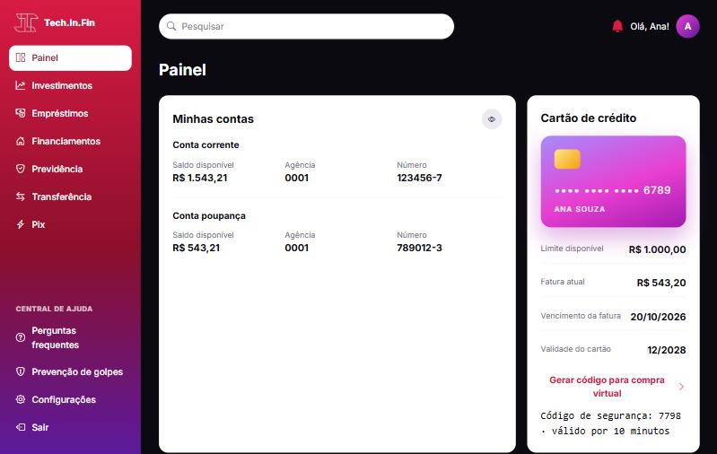
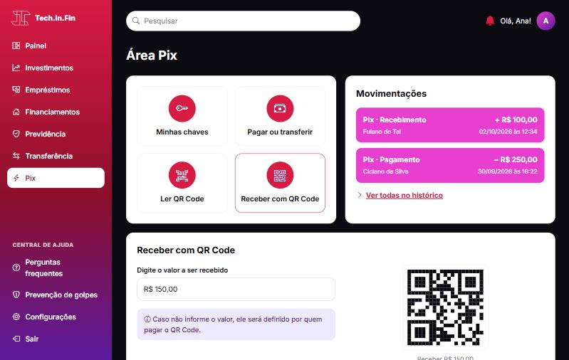
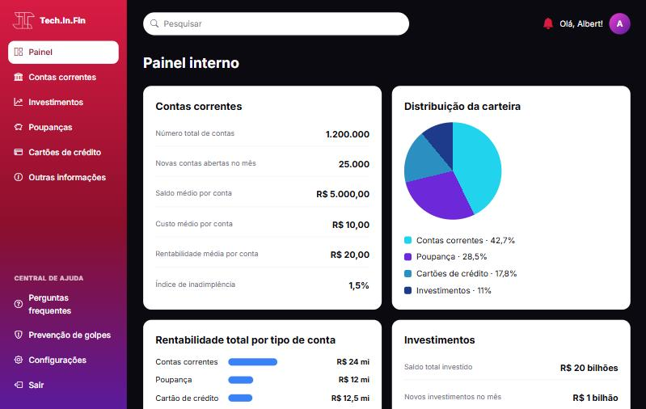
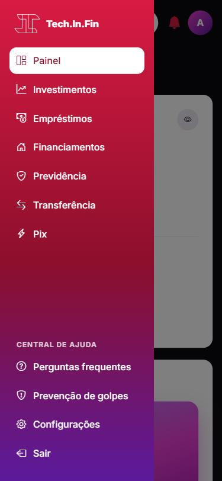

# 🏦 Banco Tech.In.Fin

Site de um **banco digital fictício** feito com **HTML, CSS e JavaScript puro**: página institucional, abertura de conta, área do cliente com painel, Pix, transferência, investimentos, empréstimos, financiamentos e previdência, e um painel interno para funcionários.

🔗 **[Abrir o site](https://nicole21carvalho.github.io/Site-de-banco/)**

<p align="center">
  
</p>

## ✨ Páginas e funcionalidades

**Site público**
- 🏠 **Página inicial:** produtos, contas para pessoa física, MEI e pessoa jurídica, novidades e agências
- 📝 **Abertura de conta:** validação de CPF e passaporte, maioridade, senha forte e **endereço preenchido pelo CEP** ([ViaCEP](https://viacep.com.br))
- 🔐 **Entrada** separada para clientes (CPF e senha) e funcionários (e-mail corporativo)

**Área do cliente**
- 📊 **Painel:** saldos com botão para **ocultar valores**, cartão de crédito, gráfico de investimentos, histórico expansível e código para compra virtual
- ⚡ **Pix:** minhas chaves (com botão de copiar), pagar ou transferir e receber com QR Code
- 💸 **Transferência, investimentos, empréstimos, financiamentos e previdência:** formulários com máscara de dinheiro, valores mínimos, **assinatura digital** desenhada com o mouse ou o dedo e aceite dos termos

**Área do funcionário**
- 📈 **Painel interno:** indicadores de contas, poupança, cartões e investimentos, com gráficos de pizza e de barras feitos só com CSS

<p align="center">
  
  
</p>
<p align="center">
  
  
</p>

## 🧠 Decisões técnicas

- **Formulários de verdade:** na primeira versão, os formulários e o painel eram **imagens exportadas do Figma**, sem nenhum campo. Agora todos são HTML com validação.
- **Componentes sem build:** cabeçalho, rodapé e menu lateral eram copiados em cada página. Agora o [`js/layout.js`](js/layout.js) monta essas partes, e cada página só indica onde está com atributos como `data-pagina="pix"`.
- **Comportamento ligado por atributos:** o [`js/formularios.js`](js/formularios.js) procura atributos como `data-moeda`, `data-cpf`, `data-minimo` e `data-assinatura`. Um formulário novo não precisa de JavaScript próprio.
- **Regras testadas:** as validações e máscaras ficam em [`js/validacao.js`](js/validacao.js), como funções puras, com testes no test runner do Node.js.
- **Gráficos sem biblioteca:** barras com variáveis CSS (`--valor`) e pizza com `conic-gradient`.
- **Desempenho:** as imagens caíram de cerca de **6 MB** para **360 KB** (PNG → JPEG redimensionado) e carregam com `loading="lazy"`.
- **Acessibilidade:** HTML semântico, rótulos em todos os campos, foco levado ao primeiro erro, `aria-current` no menu, `aria-live` nas confirmações e textos alternativos nos gráficos.

## 🛠️ Tecnologias

HTML · CSS (Grid, Flexbox, variáveis, `conic-gradient`) · JavaScript (DOM, Canvas, Fetch, Clipboard API) · Bootstrap Icons · Node.js Test Runner

## 📁 Estrutura

```
index.html, entrar*.html, cadastro*.html   → site público
conta/          → área do cliente (painel, pix, transferência, investimentos, empréstimos, financiamentos, previdência)
funcionario/    → painel interno
css/style.css   → estilo de todo o site
js/layout.js       → cabeçalho, rodapé e menu lateral
js/formularios.js  → máscaras, validação, assinatura e envio
js/validacao.js    → regras puras (+ validacao.test.js)
js/cadastro.js, js/painel.js, js/pix.js   → comportamentos de cada página
img/            → imagens otimizadas
```

## 🚀 Como executar

Abra o [site publicado](https://nicole21carvalho.github.io/Site-de-banco/) ou baixe o repositório e abra o `index.html`.

Para entrar na área do cliente, use qualquer CPF válido (ex.: `529.982.247-25`) e uma senha com 6 caracteres ou mais. Não existe servidor: nenhum dado sai do navegador.

Para rodar os testes (precisa do [Node.js](https://nodejs.org/) 18 ou mais recente):

```bash
node --test
```

> Banco fictício, criado para estudo.
